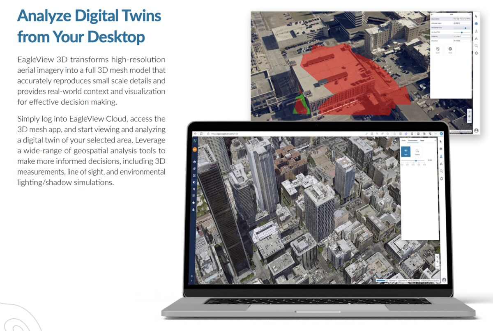
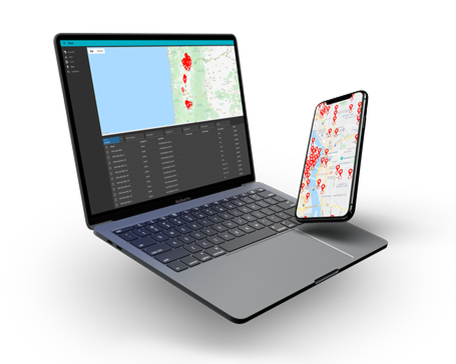

### Hi, I'm Brandon 👋

&nbsp;

&nbsp;

 

**Senior Full-Stack Engineer** — AI & agentic systems, GIS & mapping, real estate tech.
Navy veteran, former licensed Realtor, and the kind of engineer who can drop into any
layer of a product and ship. Most of my work is private, but here's what I can show.

 

# 🛡️ Tether RE — Real Estate Agent Safety Platform

> *Because the most important part of any deal is making it home safe.*

A personal safety platform for real estate agents: real-time monitoring,
one-touch emergency dispatch, struggle & impact detection, and client screening —
from first contact through close. As **Head of Engineering**, I took over the
entire engineering function as the company consolidated to a single engineer, and
owned the product from a B2C app through a full pivot to B2B SaaS.

&nbsp;

&nbsp;

**What I built:**

- **Real-time location layer** — live GPS tracking, proximity-based safety alarms,
  and group navigation that keeps an agent and their clients synced on the same
  route in real time.
- **Custom Flutter + MapLibre navigation package** — migrated the mapping stack off
  Mapbox to open-source MapLibre, cutting mapping and routing costs by ~90%. Built in
  Flutter with native iOS (Swift) and Android (Kotlin/Java) modules where the platform
  needed it.
- **AI receipt parsing** for expense tracking, built on AWS Bedrock.
- **Core business systems** — StaxBill subscription & enterprise billing with
  org-hierarchy revenue reporting, HubSpot account tooling, UserPilot analytics.
- **AI analytics dashboards** unifying billing, usage, and revenue for leadership.

**Traction:** 0 → **$40K MRR**, **5,000 users**, multiple enterprise contracts ·
🏆 won the **2024 T3 Technology Summit Pitch Battle** · selected for the
**NAR REACH Accelerator**.

 

# 🛰️ EagleView — Aerial Imagery & Property Intelligence

GIS-powered web applications for aerial imagery analysis and property intelligence,
built on a customized fork of Mapbox. I worked across both **Cloud Explorer** (viewing,
measurement, and analysis of high-resolution aerial imagery) and **EagleView 3D**
(digital-twin mesh models for 3D measurement, line of sight, and shadow analysis).

- Converted **ArcGIS** tile data into **Mapbox**-compatible tiles to bridge two
  geospatial ecosystems, and migrated a legacy GIS platform to scalable cloud services.
- Built a life-safety feature letting **911 dispatchers determine a caller's elevation
  inside a building** during emergency calls, and implemented **Okta SSO**.

 

# 📡 QuickSCIP — 5G Deployment & Site Selection

A geospatial data-collection platform for the 5G network rollout that maps cell-tower
sites and turns field data into the drawings used for permitting and construction. It
pairs a **Site Selector** mobile app with a **Control Tower** web dashboard — and, per
Thirtythree, lets crews complete deployments up to **10× faster**.

- Full-stack across mobile capture, the dynamic mapping layer (street / satellite /
  360°), and automated report generation (Word / Excel / PDF) — in **React, React
  Native, Node.js, and Go**.
- In testing: full site assessments in **under 10 minutes**, and **1,500 candidate
  SCIPs processed in under 10 days**.

 

# 🛠 Tech Stack

#### Languages

#### Mobile & Mapping

#### AI & Agents

#### Backend & Data

#### Cloud & DevOps

 

# 📌 More

Deeper write-ups on all three projects live in my pinned
**[portfolio](https://github.com/brandub/portfolio)** repo.

📫 &nbsp; brandub@gmail.com &nbsp; · &nbsp; 📍 Richland, WA
